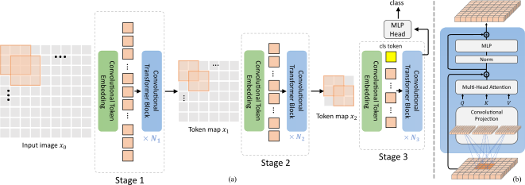

# Introduction
This is an official implementation of [CvT: Introducing Convolutions to Vision Transformers](https://arxiv.org/abs/2103.15808). We present a new architecture, named Convolutional vision Transformers (CvT), that improves Vision Transformers (ViT) in performance and efficienty by introducing convolutions into ViT to yield the best of both designs. This is accomplished through two primary modifications: a hierarchy of Transformers containing a new convolutional token embedding, and a convolutional Transformer block leveraging a convolutional projection. These changes introduce desirable properties of convolutional neural networks (CNNs) to the ViT architecture (e.g. shift, scale, and distortion invariance) while maintaining the merits of Transformers (e.g. dynamic attention, global context, and better generalization). We validate CvT by conducting extensive experiments, showing that this approach achieves state-of-the-art performance over other Vision Transformers and ResNets on ImageNet-1k, with fewer parameters and lower FLOPs. In addition, performance gains are maintained when pretrained on larger dataset (e.g. ImageNet-22k) and fine-tuned to downstream tasks. Pre-trained on ImageNet-22k, our CvT-W24 obtains a top-1 accuracy of 87.7% on the ImageNet-1k val set. Finally, our results show that the positional encoding, a crucial component in existing Vision Transformers, can be safely removed in our model, simplifying the design for higher resolution vision tasks. 



# Main results
## Models pre-trained on ImageNet-1k
| Model  | Resolution | Param | GFLOPs | Top-1 |
|--------|------------|-------|--------|-------|
| CvT-13 | 224x224    | 20M   | 4.5    | 81.6  |
| CvT-21 | 224x224    | 32M   | 7.1    | 82.5  |
| CvT-13 | 384x384    | 20M   | 16.3   | 83.0  |
| CvT-21 | 384x384    | 32M   | 24.9   | 83.3  |

## Models pre-trained on ImageNet-22k
| Model   | Resolution | Param | GFLOPs | Top-1 |
|---------|------------|-------|--------|-------|
| CvT-13  | 384x384    | 20M   | 16.3   | 83.3  |
| CvT-21  | 384x384    | 32M   | 24.9   | 84.9  |
| CvT-W24 | 384x384    | 277M  | 193.2  | 87.6  |

You can download all the models from our [model zoo](https://1drv.ms/u/s!AhIXJn_J-blW9RzF3rMW7SsLHa8h?e=blQ0Al).


# Quick start
## Installation
Assuming that you have installed PyTorch and TorchVision, if not, please follow the [officiall instruction](https://pytorch.org/) to install them firstly. 
Intall the dependencies using cmd:

``` sh
python -m pip install -r requirements.txt --user -q
```

The code is developed and tested using pytorch 1.7.1. Other versions of pytorch are not fully tested.

## Data preparation
Please prepare the data as following:

``` sh
|-DATASET
  |-imagenet
    |-train
    | |-class1
    | | |-img1.jpg
    | | |-img2.jpg
    | | |-...
    | |-class2
    | | |-img3.jpg
    | | |-...
    | |-class3
    | | |-img4.jpg
    | | |-...
    | |-...
    |-val
      |-class1
      | |-img5.jpg
      | |-...
      |-class2
      | |-img6.jpg
      | |-...
      |-class3
      | |-img7.jpg
      | |-...
      |-...
```


## Run
Each experiment is defined by a yaml config file, which is saved under the directory of `experiments`. The directory of `experiments` has a tree structure like this:

``` sh
experiments
|-{DATASET_A}
| |-{ARCH_A}
| |-{ARCH_B}
|-{DATASET_B}
| |-{ARCH_A}
| |-{ARCH_B}
|-{DATASET_C}
| |-{ARCH_A}
| |-{ARCH_B}
|-...
```

We provide a `run.sh` script for running jobs in local machine.

``` sh
Usage: run.sh [run_options]
Options:
  -g|--gpus <1> - number of gpus to be used
  -t|--job-type <aml> - job type (train|test)
  -p|--port <9000> - master port
  -i|--install-deps - If install dependencies (default: False)
```

### Training on local machine

``` sh
bash run.sh -g 8 -t train --cfg experiments/imagenet/cvt/cvt-13-224x224.yaml
```

You can also modify the config parameters from the command line. For example, if you want to change the lr rate to 0.1, you can run the command:
``` sh
bash run.sh -g 8 -t train --cfg experiments/imagenet/cvt/cvt-13-224x224.yaml TRAIN.LR 0.1
```

Notes:
- The checkpoint, model, and log files will be saved in OUTPUT/{dataset}/{training config} by default.

### Testing pre-trained models

``` sh
bash run.sh -t test --cfg experiments/imagenet/cvt/cvt-13-224x224.yaml TEST.MODEL_FILE ${PRETRAINED_MODLE_FILE}
```

# Citation
If you find this work or code is helpful in your research, please cite:

```
@article{wu2021cvt,
  title={Cvt: Introducing convolutions to vision transformers},
  author={Wu, Haiping and Xiao, Bin and Codella, Noel and Liu, Mengchen and Dai, Xiyang and Yuan, Lu and Zhang, Lei},
  journal={arXiv preprint arXiv:2103.15808},
  year={2021}
}
```
## Contributing

This project welcomes contributions and suggestions.  Most contributions require you to agree to a
Contributor License Agreement (CLA) declaring that you have the right to, and actually do, grant us
the rights to use your contribution. For details, visit https://cla.opensource.microsoft.com.

When you submit a pull request, a CLA bot will automatically determine whether you need to provide
a CLA and decorate the PR appropriately (e.g., status check, comment). Simply follow the instructions
provided by the bot. You will only need to do this once across all repos using our CLA.

This project has adopted the [Microsoft Open Source Code of Conduct](https://opensource.microsoft.com/codeofconduct/).
For more information see the [Code of Conduct FAQ](https://opensource.microsoft.com/codeofconduct/faq/) or
contact [opencode@microsoft.com](mailto:opencode@microsoft.com) with any additional questions or comments.

## Trademarks

This project may contain trademarks or logos for projects, products, or services. Authorized use of Microsoft 
trademarks or logos is subject to and must follow 
[Microsoft's Trademark & Brand Guidelines](https://www.microsoft.com/en-us/legal/intellectualproperty/trademarks/usage/general).
Use of Microsoft trademarks or logos in modified versions of this project must not cause confusion or imply Microsoft sponsorship.
Any use of third-party trademarks or logos are subject to those third-party's policies.
